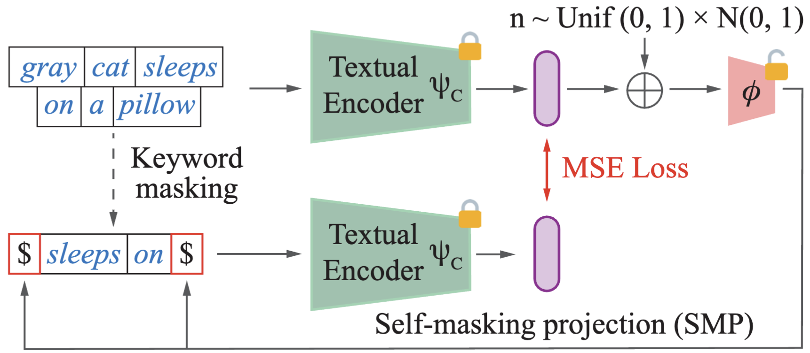

## LinCIR: Language-only Training of Zero-shot Composed Image Retrieval
Welcome to the official Pytorch implementation of LinCIR!

Discover the magic of **LinCIR**, a ground-breaking approach to Composed Image Retrieval (CIR) that challenges convention and ushers in a new era of AI research. Dive into the limitless possibilities of zero-shot composed image retrieval with us!

**[Read the Paper 📜](https://arxiv.org/abs/2312.01998)** | [Try the Demo 🤗]

**Authors**: 

**[Geonmo Gu](https://geonm.github.io/)\*<sup>1</sup>, [Sanghyuk Chun](https://sanghyukchun.github.io/home/)\*<sup>2</sup>, [Wonjae Kim](https://wonjae.kim)<sup>2</sup>, [Yoohoon Kang](https://www.linkedin.com/in/yoohoon-kang-59895644)<sup>1</sup>, [Sangdoo Yun](https://sangdooyun.github.io)<sup>2</sup>**

<sup>1</sup> NAVER Vision <sup>2</sup> NAVER AI Lab

\* First two authors contributed equally.

## ⭐ Overview


The Composed Image Retrieval (CIR) task, a fusion of image and text, has always been an intriguing challenge for AI researchers. Traditional CIR methods require expensive triplets of query image, query text, and target image for training, limiting scalability.

Enter LinCIR, a revolutionary CIR framework that relies solely on language for training. Our innovative approach leverages self-supervision through self-masking projection (SMP), allowing LinCIR to be trained using text datasets alone.

With LinCIR, we achieve astonishing efficiency and effectiveness. For instance, LinCIR with a CLIP ViT-G backbone is trained in just 48 minutes and outperforms existing methods in zero-shot composed image retrieval on four benchmark datasets: CIRCO, GeneCIS, FashionIQ, and CIRR. In fact, it even surpasses supervised methods on FashionIQ!

## 🚀 News
- **December 5, 2023** - LinCIR is officially released!

## 🛠️ Installation
Get started with LinCIR by installing the necessary dependencies:

```bash
$ pip install torch transformers diffusers accelerate datasets spacy
$ python -m spacy download en_core_web_sm
```

## 📂 Dataset Preparation
No need to worry about downloading training datasets manually. All training datasets are automatically fetched using the Hugging Face datasets library.

Keep in mind that the training datasets are considerably smaller in volume compared to (image, caption) pairs or triplet datasets like FashionIQ and CIRR. 

Please refer to [here](https://github.com/miccunifi/SEARLE/tree/main#data-preparation) to prepare the benchmark datasets.

## 📚 How to Train LinCIR
Train LinCIR with ease using the following command:

```bash
$ python -m torch.distributed.run --nproc_per_node 8 --nnodes 1 --node_rank 0 \
--master_addr localhost --master_port 5100 train_phi.py \
--batch_size 64 \
--output_dir /path/to/your_experiment \
--cirr_dataset_path /path/to/cir_datasets/CIRR \
--mixed_precision fp16 \
--clip_model_name large \
--validation_steps 500 \
--checkpointing_steps 500 \
--seed 12345 \
--lr_scheduler constant_with_warmup --lr_warmup_steps 0 \
--max_train_steps 30000
```

If you have a powerful GPU machine with 8 GPUs, simply run the above script. For less powerful GPU machine with single GPU, set `--nuproc_per_node` to 1 and adjust `--batch_size` to 256 or 512. Rest assured, the results will be consistent.

If you'd like to use ViT-Base, Large, Huge or Giga as CLIP backbone, change `--clip_model_name` to base, large, huge, or giga each.

## 💯 How to Evaluate LinCIR

### CIRR (Test Set)
Evaluate LinCIR on the CIRR test set with the following command:

```bash
$ python generate_test_submission.py \
--eval-type phi \
--dataset cirr \
--dataset-path /path/to/CIRR \
--phi-checkpoint-name /path/to/trained_your_phi_XXXXXXXXXX.pt \
--clip_model_name large \
--submission-name cirlo_results
```

Retrieved results will be saved as:
- `./submission/cirr/{submission-name}.json`
- `./submission/cirr/subset_{submission-name}.json`

Upload these files [here](https://cirr.cecs.anu.edu.au/test_process/) to view the results.

### CIRR (Validation Set, Dev)
For the CIRR validation set, use the following command:

```bash
$ python validate.py \
--eval-type phi \
--dataset cirr \
--dataset-path /path/to/CIRR \
--phi-checkpoint-name /path/to/trained_your_phi_XXXXXXXXXX.pt \
--clip_model_name large
```

### FashionIQ
To evaluate LinCIR on FashionIQ, run the following command:

```bash
$ python validate.py \
--eval-type phi \
--dataset fashioniq \
--dataset-path /path/to/fashioniq \
--phi-checkpoint-name /path/to/trained_your_phi_XXXXXXXXXX.pt \
--clip_model_name large
```

### CIRCO
Evaluate LinCIR on the CIRCO dataset with the command below:

```bash
$ python generate_test_submission.py \
--eval-type phi \
--dataset circo \
--dataset-path /path/to/cir_datasets/CIRCO \
--phi-checkpoint-name /path/to/trained_your_phi_XXXXXXXXXX.pt \
--clip_model_name large \
--submission-name cirlo_results
```

Retrieved results will be saved as:
- `./submission/circo/{submission-name}.json`
- `./submission/circo/subset_{submission-name}.json`

Upload these files [here](https://circo.micc.unifi.it/evaluation) to view the results.

### GeneCIS
Evaluating GeneCIS requires a few additional steps. Check out the `eval_genecis` branch and make the necessary adjustments to the configuration in `./eval_genecis/config.py`. Then, run the following script:

```bash
$ cd eval_genecis

$ python evaluate.py \
--combiner_mode phi \
--model large \
--combiner_pretrain_path /path/to/trained_your_phi_XXXXXXXXXX.pt
```

## Acknowledgement
We would like to express our special gratitude to the authors of [SEARLE](https//github.com/miccunifi/SEARLE) for their invaluable contributions, as our code draws significant inspiration from this open-source project.

## Citation
```
@article{gu2023lincir,
  title={Language-only Efficient Training of Zero-shot Composed Image Retrieval},
  author={Gu, Geonmo and Chun, Sanghyuk and Kim, Wonjae and and Kang, Yoohoon and Yun, Sangdoo},
  journal={arXiv preprint arXiv:2312.01998},
  year={2023}
}
```

## License

Licensed under [CC BY-NC 4.0](LICENSE)

```
LinCIR
Copyright (c) 2023-present NAVER Corp.
CC BY-NC-4.0 (https://creativecommons.org/licenses/by-nc/4.0/)
```
